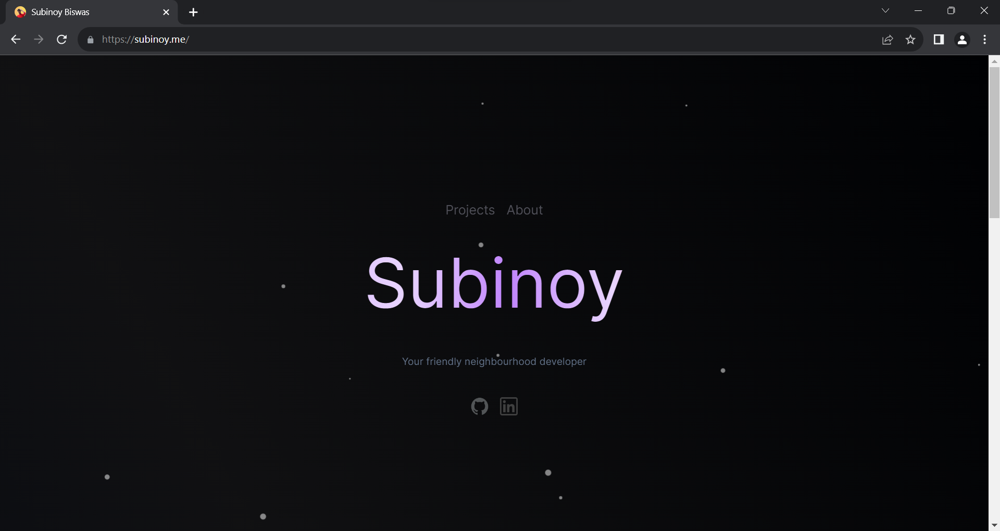
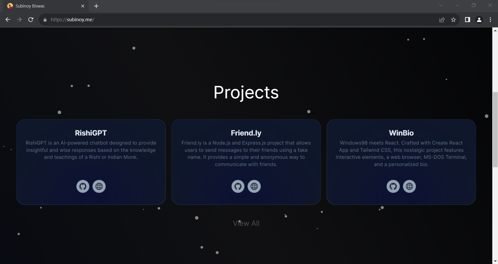
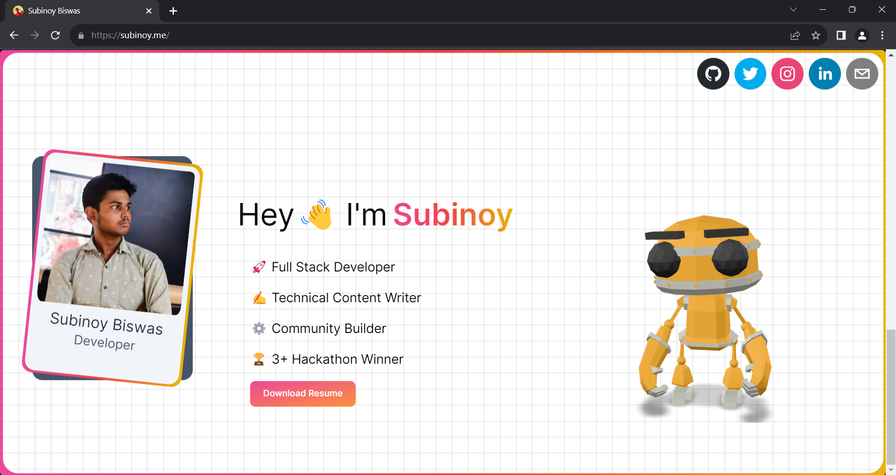

# Next.js Portfolio

Welcome to my Portfolio made with Next.js! This dynamic portfolio showcases my projects with exciting features like Parallax effects, 3D Models, and a powerful dashboard for analytics.

## Features

- **Dynamic Content**: Pulls project data from a database, allowing for easy updates and additions.
- **Parallax Effects**: Engages with visitors with visually appealing parallax scrolling effects.
- **3D Model View**: Showcases projects in a unique way with interactive 3D models.
- **Powerful Dashboard**: Shows analytics for the portfolio site through a secure and private dashboard(yet to be public).
- **Responsive Design**: Ensures a seamless experience on various devices.
- **Interactive Particles**: Enhances user experience with dynamic and interactive particles that respond to user actions.

## Visit the Portfolio

The portfolio is public and can be visited [here](https://subinoy.me)

## Screenshots


_Landing Page Hero Section_


_Portfolio Project Showcase Section_


_Portfolio Project About Me Section_

## Getting Started

Follow these steps to set up and run the Next.js Portfolio on your local machine.

1. **Clone the Repository:**
   ```bash
   git clone https://github.com/subinoybiswas/Portfolio.git
   ```
2. **Install Dependencies**:

   ```bash
   cd Portfolio
   npm install
   ```

3. **Configuration:**

   1. Set up your Vercel PostgreSQL database update the configuration details in the Configuration section and put the details in the `.env.development.local` file.

   2. Set up Google Analytics and Analytics Data API and put the following env variables in the `.env` file:

      ```
      CLIENT_EMAIL= //Google Cloud Service Account Email
      PROPERTY_ID= //Google Analytics Property ID
      PRIVATE_KEY= //From Google Cloud
      NEXT_PUBLIC_GA_MEASUREMENT_ID=// Google Analytics Measurement ID
      ```

4. **Run the Development Server**:

   After configuring correctly, the project can be run locally.

   ```
   npm run dev
   ```

5. **Access the Portfolio**:

   Open your browser and navigate to http://localhost:3000 to view your portfolio.

## Contributing

If you'd like to contribute to WinBio, feel free to open an issue or submit a pull request. All contributions are welcome!
